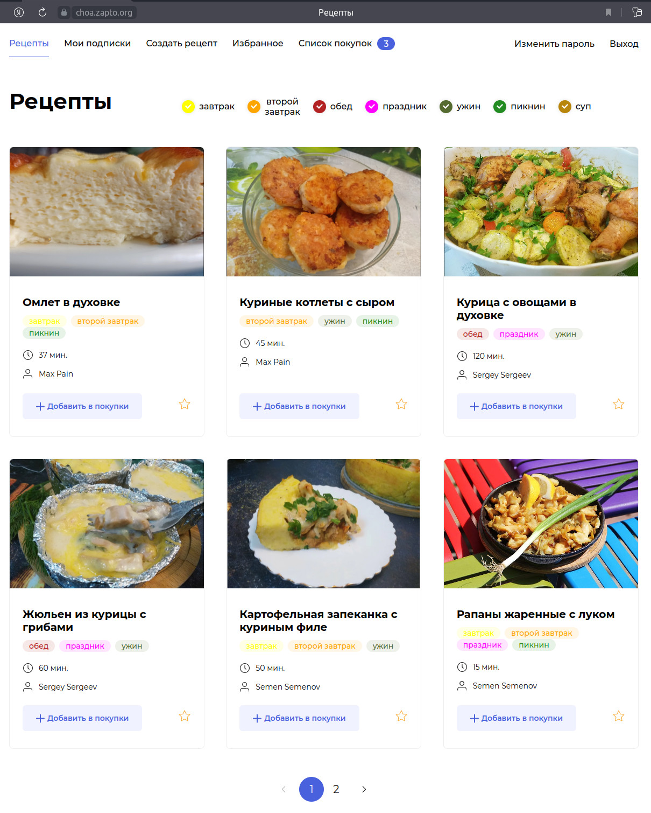

# API для проекта публикации рецептов блюд (Foodgram)
## Стек технологий
[](https://www.python.org/)
[](https://www.djangoproject.com/)
[](https://www.django-rest-framework.org/)
[](https://djoser.readthedocs.io/en/latest/getting_started.html)
[](https://www.postgresql.org/)
[](https://nginx.org/ru/)
[](https://gunicorn.org/)
[](https://www.docker.com/)
[](https://github.com/features/actions)
### Разработчик:

👨🏼‍💻Олег Чужмаров: https://github.com/floks41

:small_orange_diamond: **Пояснение.**
> Проект Foodgram «Продуктовый помощник»: сайт, на котором пользователи публикуют рецепты, добавляют чужие рецепты в избранное и подписываются на публикации других авторов. Сервис «Список покупок» позволяет пользователям создавать список продуктов, которые нужно купить для приготовления выбранных блюд.
Задачей курсового проекта является разработка бекенда приложения Foodgr

[]

### Структура проекта
- frontend - файлы фронтенда приложения на React, запускаются только для сборки;
- infra — инфраструктура проекта: конфигурационный файл nginx, docker-compose.yml и docker-compose.production.yml;
- backend - файлы бекенда приложения - это и есть курсовой проект;
- backend/data - содержит файлы в формате csv с тестовыми данными для проверки работы проекта, а также текстовые изображения к рецептам.
### Тестовые данные
 - для создания тестового суперпользователя-администратора необходимо выполнить команду `python3 manage.py make_admin` (будет создан пользователь с username: admin и паролем из файла .env)
 - для загрузки тестовых данных - команду `python3 manage.py load_test_data`

### Технологии
- Python 3.9
- Django 3.2.19
- Django Rest Framework 3.14.0
- Djoser 2.2.0
- PostgreSQL 13
- Nginx 1.22.1
- Docker Compose 3.3

### Описание проекта
Что могут делать неавторизованные пользователи:
- Создать аккаунт;
- Просматривать рецепты на главной;
- Просматривать отдельные страницы рецептов;
- Фильтровать рецепты по тегам;

Что могут делать авторизованные пользователи:
- Входить в систему под своим логином и паролем;
- Выходить из системы (разлогиниться);
- Менять свой пароль;
- Создавать/редактировать/удалять собственные рецепты;
- Просматривать рецепты на главной;
- Просматривать страницы пользователей;
- Просматривать отдельные страницы рецептов;
- Фильтровать рецепты по тегам;
- Работать с персональным списком избранного: добавлять в него рецепты или удалять их, просматривать свою страницу избранных рецептов;
- Работать с персональным списком покупок: добавлять/удалять любые рецепты, выгружать файл с количеством необходимых ингридиентов для рецептов из списка покупок;
- Подписываться на публикации авторов рецептов и отменять подписку, просматривать свою страницу подписок;

Что могут делать администраторы:
- Администратор обладает всеми правами авторизованного пользователя;
- (панель администратора) Изменять пароль любого пользователя;
- (панель администратора) создавать/блокировать/удалять аккаунты пользователей;
- (панель администратора) редактировать/удалять любые рецепты;
- (панель администратора) добавлять/удалять/редактировать ингредиенты;
- (панель администратора) добавлять/удалять/редактировать теги;

### Документация
Подробное описание ресурсов доступно в документации после запуска проекта по адресу `http://localhost/api/docs/`.

В документации указаны ресурсы, разрешённые типы запросов, права доступа и дополнительные параметры (паджинация, поиск, фильтрация и т.д.), там где это необходимо.

# Как запустить проект

## Локальный запуск проекта (backend запускается локально, остальные части в контейнерах docker compose)
1. Скопируйте репозиторий и перейдите в него в командной строке:

```
git clone git@github.com:floks41/foodgram.git (https://github.com/floks41/foodgram.git)
```

```
cd foodgram
```

2. Создайте и активируйте виртуальное окружение:

```
python3 -m venv venv
```

```
source venv/bin/activate
```

3. Установите зависимости из файла requirements.txt:

```
cd backend
```

```
python3 -m pip install --upgrade pip
```
pip install -r requirements.txt
```
```
4. В корневой папке проекта находится файл .env.example cоздайте по аналогии с ним фаил .env: 

```
POSTGRES_DB=kotogram
POSTGRES_USER=kotogram_user
POSTGRES_PASSWORD=kotogram_password
DB_HOST=database_host
DB_PORT=5432 
SECRET_KEY=django-settings-secret-key
ALLOWED_HOSTS=127.0.0.1 localhost backend
ADMIN_PASSWORD=super_secret_password_for_username_admin
```
5. Примените следующие настройки docker compose например из файла 'docker-compose.local.yml':

```
version: '3.3'
volumes:
  static:
  media:
  pg_data:
services:
  db:
    image: postgres:13
    env_file:
      - .env
    ports:
      - 5432:5432
    volumes:
      - pg_data:/var/lib/postgresql/data/
    healthcheck:
      test: [ "CMD", "pg_isready", "-q", "-d", "${POSTGRES_DB}", "-U", "${POSTGRES_USER}" ]
      timeout: 45s
      interval: 10s
      retries: 10
    
  frontend:
    build: ./frontend
    env_file: .env
    command: cp -r /app/build/. /static/
    volumes:
      - static:/static

  gateway:
    build: ./nginx/
    env_file: .env
    ports:
      - "80:80"
    volumes:
      - static:/static
      - media:/media
      - ./docs/:/usr/share/nginx/html/api/docs/
```  
6. Примените следующие настройки для 'nginx.conf':

```
server {
    listen 80;
    location /api/ {
        proxy_pass http://host.docker.internal:8000;
    }
    location /admin/ {
        proxy_pass http://host.docker.internal:8000/admin/;
    }
    location /api/docs/ {
        root /usr/share/nginx/html;
        try_files $uri $uri/redoc.html;
    }
    location / {
        alias /static/;
        try_files $uri $uri/ /index.html;
    }
     
}
```
7. Перейдите в корень проекта 'foodgram' и выполните команду сборки контейнеров:
```
cd ..
```
```
sudo docker compose -f docker-compose.local.yml up
```
Документация по API в формате ReDOC по адресу `http://localhost/api/docs/redoc.html`

8. Выполните миграции:

```
cd backend
```
```
python3 manage.py makemigrations
```
```
python3 manage.py migrate
```
9. Соберите статику бекэнда и посместите в volume `static` для контейнера `gateway`.

```
python3 manage.py collectstatic
```
  Найдите контейнер `gateway` при помощи команды `sudo docker container ls` и скопируйте статику бекенда

```
sudo docker cp collected_static/. <gateway_container_id>:/static
```

10. Для создания тестового суперпользователя (администратора) и загрузки тестовых данных выполните команды:

```
python3 manage.py make_admin
```
```
python3 manage.py load_test_data
```
11. Запустите бекэнд сервер:

```
python3 manage.py runserver
```
Приложение будет доступно на локальной машине по адресу http://localhost/

## Запуск проекта в контейнерах docker compose (образы на Dockerhub) локально или на сервере

1. Создайте и перейдите в директорию, например, `Foodgram`

```
mkdir foodgram
```
```
cd foodgram
```
2. Поместите в указанную директорию файлы `.env` и `docker-compose.production.yml`

3. Запустите контейнеры

```
sudo docker compose -f docker-compose.production.yml up --build -d
```
4. Приложение будет доступно локально по адресу `http://localhost:9000/`.

   При запуске контейнера backend автоматически будет создан суперпользователь с правами администратора username: admin, с паролем, указанным в .env., выполнены миграции и созданы несколько тестовых пользователей, загружены тестовые данные, включая ингредиенты, теги, рецепты, изображениями рецептов, подписки, избранное, корзины для покупок. 

5. Примените на сервере настройки внешнего nginx, например такие:

```
server {
    
    server_name 158.160.66.88 choa.zapto.org;
    server_tokens off;
    location / {
        proxy_set_header Host $http_host;
	proxy_pass http://127.0.0.1:9000;
    }

} 
```
6. Приложение будет доступно локально по адресу `http://choa.zapto.org/`

## Автоматическое развертывание на сервере с использование GitHub Action workflow

1. Пример action для github сохранен в файле `infra/main.yml` в корневой директории проекта, при необходимости запуска скопируйте содержимое файла в `.github/workflows/main.yml`. 
Развертывание осуществляется с помощью workflow по тригеру - push в ветку `master`.

2. Для работы workflows на Github настройках репозитория необходимо сохранить секретные переменные (action secrets):

```
POSTGRES_USER - <имя пользователя базы данных PostgreSQL>
POSTGRES_PASSWORD - <пароль пользователя базы данных PostgreSQL>
POSTGRES_DB - <имя базы данных PostgreSQL>
DB_PORT - <порт соединения для PostgreSQL>
DOCKER_USERNAME - <имя пользователя для DockerHub>
DOCKER_PASSWORD - <пароль пользователя для DockerHub>
HOST - <IP адрес удаленного сервера>
USER - <имя пользователя для соединения с сервером>
SSH_KEY - <закрытый ключ SSH для соединения с сервером>
SSH_PASSPHRASE - <passphrase закрытого ключа SSH для соединения с сервером>
TELEGRAM_TO - <Ваш ID в телеграм, кому прислать уведомление об успешном деплое>
TELEGRAM_TOKEN  - <токен чат-бота в телеграм, который отправит уведомление>
```
3. При запуске контейнера backend на сервере будут произведены миграции и собрана статика, автоматически будет создан суперпользователь с правами администратора username: admin, с паролем, указанным в .env., выполнены миграции и созданы несколько тестовых пользователей, загружены тестовые данные, включая ингредиенты, теги, рецепты, изображениями рецептов, подписки, избранное, корзины для покупок. Тестовые данные будут загружены только при отсутсвии данных в БД.

## В дополнение
1. В папке infra находятся файлы:

```
foodgram_site.txt - c данными для доступак к приложению.
```
```
default - файл конфигурации внешнего nginx на виртуальной машине в Яндекс облаке.
```
2. В корне проекта находятся файлы:

```
.env.example - <пример заполнения для .env>
```
```
docker-compose.yml - <полный файл контейнеризации без загрузки образов на DockerHub, для локальной разработки в контейнерах>
```
```
docker-compose.local.yml - <файл контейнеризации без бекенда без загрузки образов на DockerHub, для локальной разработки бекенда>
```
```
docker-compose.production.yml - <полный файл контейнеризации из образов на DockerHub, для развертывания проекта>
```
3. Код бекенда проверен flake8 после линтинга isort и black:

```
isort backend/.
```
```
black backend/. --line-length 79 --skip-string-normalization --exclude "^.*\b(migrations)\b.*$"
```
